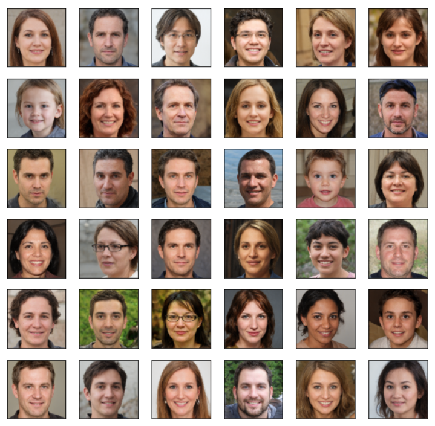
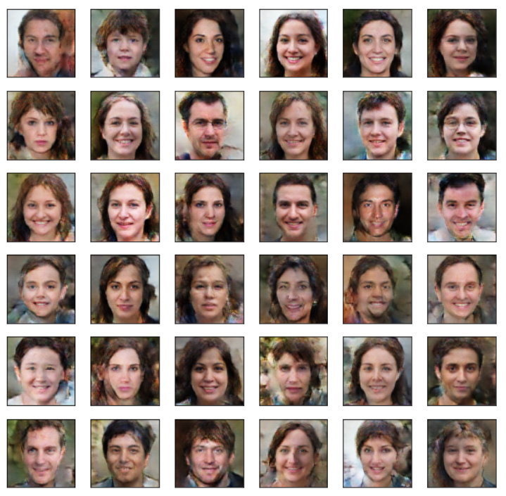

<h1>Generating Fake Faces Using GAN</h1> 

Generative Adversarial Networks(GAN) is a Deep Learning model that uses two neural networks to generate data. The two neural networks are Generator and Discriminator. A GAN model is used to generate synthetic data using a real dataset. This helps engineers to create better ML models with increased accuracy.
 

The generator network in a GAN takes random noise as input and tries to generate realistic data samples, such as images, music, or text. The discriminator network, on the other hand, takes both the generated samples from the generator and real samples from the training dataset and tries to distinguish between them.
 
 

During training, the generator and discriminator networks are trained in a competitive manner. The generator aims to produce data that is indistinguishable from the real data, while the discriminator aims to correctly classify the real and generated samples. As training progresses, both networks learn and improve their abilities. The goal of GANs is to find an equilibrium where the generator generates realistic samples that can fool the discriminator. When this equilibrium is reached, the generator is capable of generating high-quality synthetic data that resembles the original dataset.
 

<b>In this project, I have tried to use a GAN network to generate synthetic human faces using a dataset containing images of human faces.</b>
 

The <a href='https://www.kaggle.com/datasets/prasoonkottarathil/face-mask-lite-dataset'>Dataset</a> used for this project was taken from kaggle. The dataset included 10,000 training images.
 

After 20 epochs the results looked like this:

